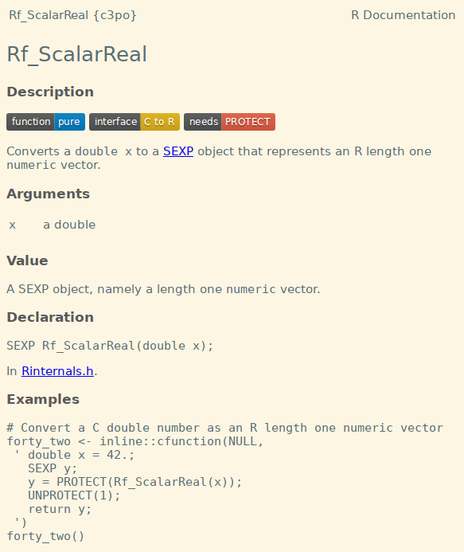

<!-- README.md is generated from README.Rmd. Please edit that file -->

```{r, include = FALSE}
knitr::opts_chunk$set(
  collapse = TRUE,
  comment = "#>",
  fig.path = "man/figures/README-",
  out.width = "100%"
)
```

# c3po 

<!-- badges: start -->
[](https://www.tidyverse.org/lifecycle/#experimental)
<!-- badges: end -->

c3po is a documentation-only package for the journey from R to C and back again.

## Installation

``` r
# install.packages("remotes")
remotes::install_github("ramiromagno/c3po")
```

## Example

To access the help page about the C function `Rf_ScalarReal`:

```{r eval=FALSE}
library(c3po)

?Rf_ScalarReal
```

